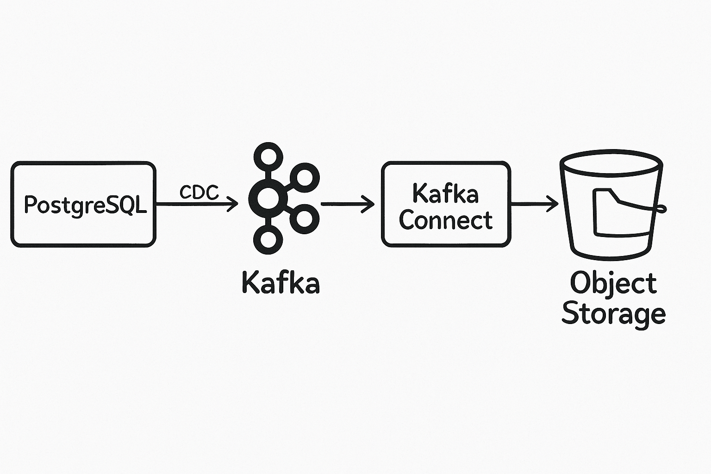
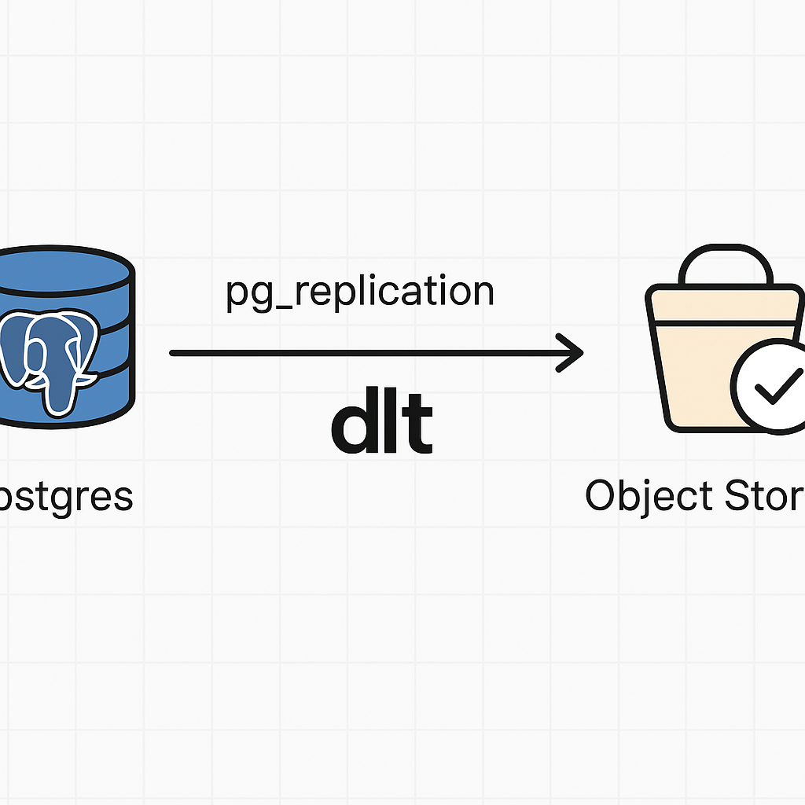

# 🧼 Change Data Capture (CDC) Hackathon Starter Guide

Welcome to the CDC Hackathon! In this challenge, we explore new ways of doing **Change Data Capture (CDC)** — the practice of tracking and reacting to changes in a database — using open-source tools and modern data infrastructure components.

This guide walks you through:
- What CDC is
- Types of CDC
- Why log-based CDC is powerful
- Some of the challenges
- The hackathon goal
- How to get started with the project setup

---

## 📌 What is CDC?
CDC (Change Data Capture) is the process of capturing changes made to data in a source system (like a database) so those changes can be propagated elsewhere, often in real time.

Instead of syncing full tables or running expensive diffs, CDC streams just the *deltas* (changes). This is perfect for real-time analytics, event-driven apps, and building streaming pipelines.

---

## 🔄 Types of CDC

### 1. **Query-based CDC**
This approach compares current and previous table states — typically by running scheduled `SELECT` queries with filters (like `updated_at > ?`).

```sql
SELECT * FROM orders WHERE updated_at > NOW() - INTERVAL '5 minutes';
```

Pros:
- Simple to implement
- Doesn’t require special DB config

Cons:
- Prone to missed or duplicate records
- Requires app cooperation (e.g. tracking timestamps)
- Inefficient for high-change workloads


---

### 2. **Log-based CDC**
This reads the *write-ahead log (WAL)* or equivalent transaction log of a database to stream changes *exactly as they happened*, including inserts, updates, and deletes.

Pros:
- Accurate and efficient
- Minimal performance impact
- Works even if apps don’t expose change timestamps

Cons:
- Requires `wal_level = logical` (Postgres)
- More complex setup

👉 **Try out this excellent interactive demo** to visualize the difference: https://change-data-capture.com

---

## ✅ Why Log-Based CDC?
- Real-time data replication
- High throughput and low latency
- Reliable change tracking with historical audit trail
- Enables stream processing, event sourcing, and decoupling systems

---

## ⚠️ Common Challenges with Log-Based CDC
- Setting up logical replication (especially on managed DBs)
- Handling schema evolution (e.g. column renames, type changes)
- Backfilling historical data vs. streaming new changes
- Dealing with deletes and tombstones
- Ensuring exactly-once delivery semantics

---

## 🏛️ Traditional CDC with Debezium, Kafka & Kafka Connect
A common approach to building production-grade CDC pipelines is by using:

- **Debezium** (CDC engine that reads from the database WAL)
- **Kafka Connect** (to stream data from source to sink)
- **Apache Kafka** (to buffer and distribute change events)

This setup is powerful but comes with its own complexities:
- Requires running multiple distributed systems (Kafka, ZooKeeper, Connect)
- Operational overhead and infrastructure costs
- Tight coupling to the Kafka ecosystem
- Challenges with local development and quick prototyping



---

## 🚀 A Pythonic Take on CDC with DLT

With [dltHub](https://github.com/dlt-hub/dlt), we explore a much more **developer-friendly, Python-native way** to:
- Ingest CDC data from PostgreSQL
- Use logical replication slots just like Debezium
- Stream changes into object storage or other destinations
- Write transformation and orchestration logic in Python

It unlocks flexible, testable CDC pipelines with minimal infra overhead.



---

## 🚀 Hackathon Objective

Use [`CDCraft`](https://github.com/JesuFemi-O/CDCraft) — a CDC simulation engine — to:

1. Simulate realistic CDC on a Postgres table (with evolving schema)
2. Pipe the change stream into **object storage** (MinIO)
3. Use tools like **DuckDB**, **MotherDuck**, or other open-source data tools to explore the changes
4. Discover fun facts, weird anomalies, patterns, or insights — and tell a story with your findings 🔍📊


The goal is to explore creative use cases of CDC and data lake-style architectures — without relying on heavyweight tools like Kafka or cloud-specific offerings.

---


## 🏋️‍⚖️ How to Get Started

1. Clone this repo
2. Run `docker-compose up -d`
3. Install and run `CDCraft` to simulate activity
4. Observe raw CDC data land in MinIO
5. Use SQLPad, DuckDB, or other tools to analyze the data
6. Build dashboards, generate insights, or tell a story!

Let’s hack some data ✨